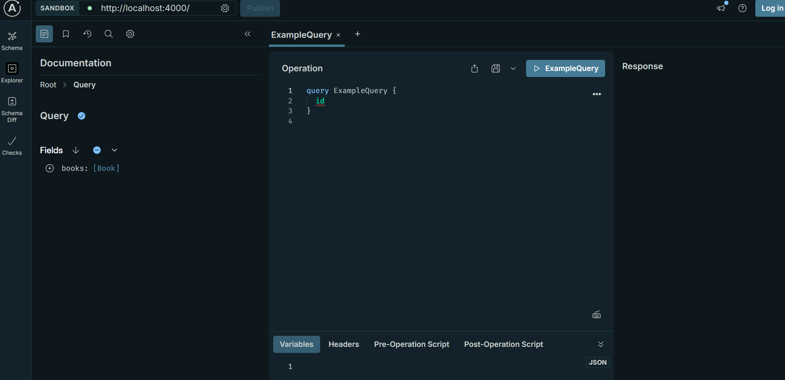
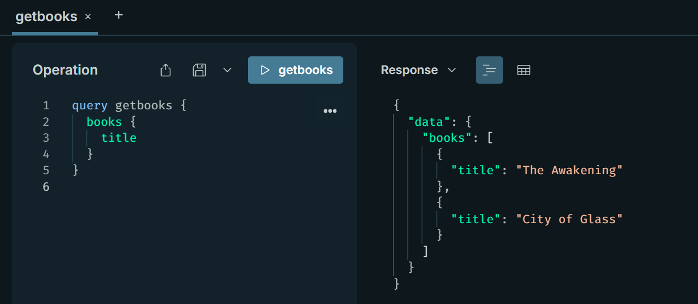
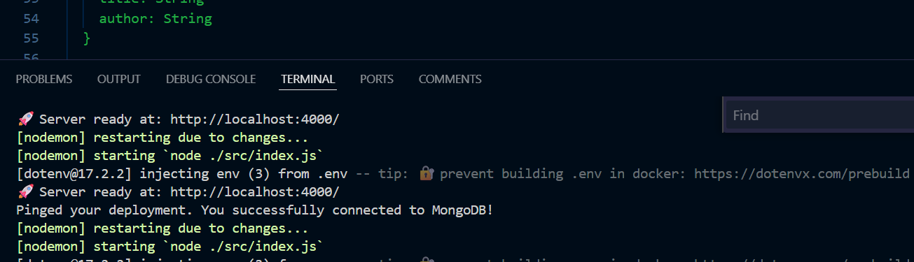

# creating noteforge

## backend

https://www.youtube.com/watch?v=hPBVIET5coo

We will be using graphQl api to create the data base which will store the todolist.

GraphQl is used for complex data querying where you dont have to define multiple apis, REST can handle it on its own.

apollo server defined in the backend

How graphQL fetches the data

will install nodemon to watch all changes.

current timestamp

Title: Build a GraphQL API with NodeJS and MongoDB (Full-stack MERN Tutorial )
Author: notJust․dev
Link: https://www.youtube.com/watch?v=hPBVIET5coo&t=2032s

Mongo DB connected 

